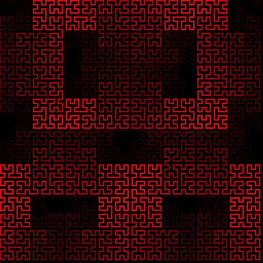
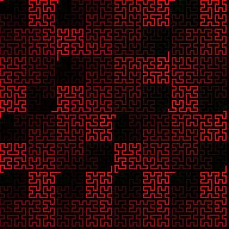
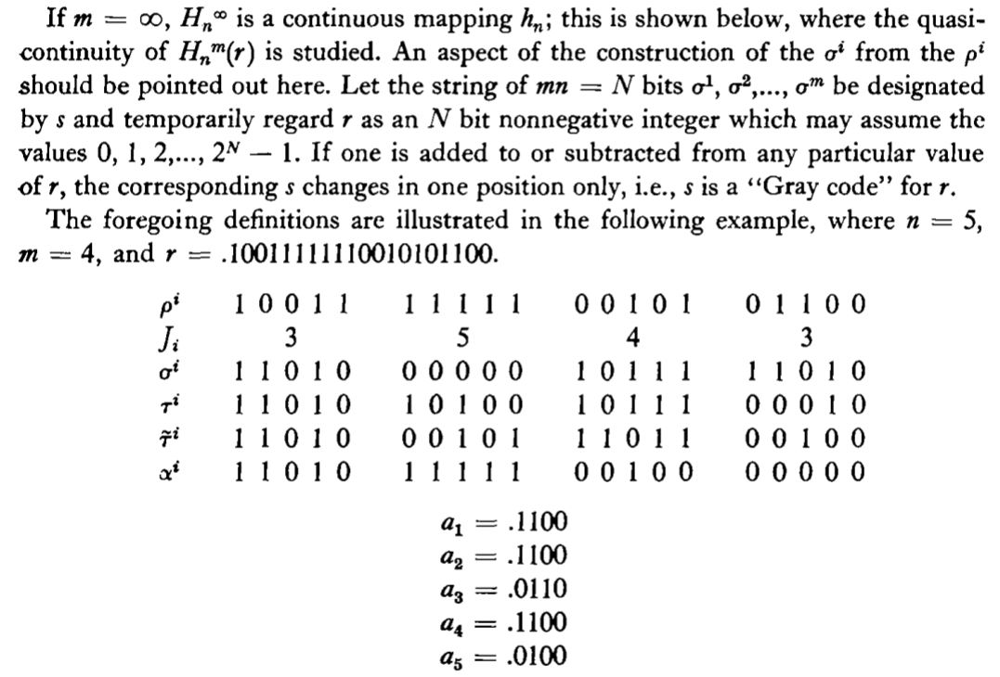
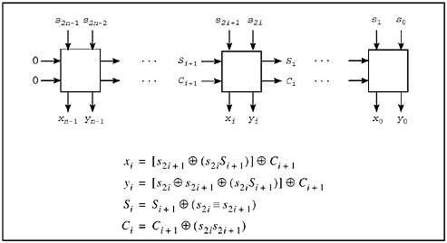

# qHilbert [](LICENSE)

qHilbert is a vectorized speedup of Hilbert curve generation using SIMD intrinsics.

||||||
|:-:|:-:|:-:|:-:|:-:|
||Serial|SSE4.2/Neon|AVX2|AVX512
|Pattern|||||
|Processor|Speedup|||||
|`i9-7900X`|-|x1.7535|x3.31794|x5.45087|
|`i3-6100`|-|x1.69253|x3.07503|-|

---

|||
|:-:|:-:|
|||

A hilbert curve is a space filling self-similar curve that provides a mapping between 2D space to 1D, and 1D to 2D space while preserving locality between mappings. Hilbert curves split a finite 2D space into recursive quadrants(similar to a [full quad-tree](https://en.wikipedia.org/wiki/Quadtree)) and traverse each quadrant in recursive "U" shapes at each iteration such that every quadrant gets fully visited before moving onto the next one.

qHilbert is an attempt at a vectorized speedup of mapping multiple linear 1D indices into planar 2D points in parallel that is based on the Butz Algorithm's<sup>1</sup> utilization of Gray code.

---

A one-dimensional index(finite distance along the curve) can be mapped into a 2D point on the hilbert curve by recursively adjusting the position of an initial 2d point (0,0) at each level recursion. The base case for a first-order hilbert curve is a 2D space of width 2 split into 4 quadrants. Each quadrant is visited in a "U" shape at the distances 0, 1, 2, and 3. Each quadrant being a vector-offset away from the origin( with `(0,0)` being the top-left). Every self-similar feature of the hilbert curve is rooted at this basis pattern with 2D vectors taking on a "gray code"-like pattern in its dimensional components

```
First order Hilbert curve of Width 2
+---+---+        +-------+    0: ( 0, 0 )
| 0 | 3 |        | +   + |    1: ( 0, 1 )
|---+---| -----> | |   | |    2: ( 1, 1 )
| 1 | 2 |        | +---+ |    3: ( 1, 0 )
+---+---+        +-------+          ^
                                    |
Notice the gray-code like pattern with the vectors
Try this python one-liner on for size and check out how it generate graycodes
    [ (1 & (x//2), 1 & ((x//2)^x)) for x in [0,1,2,3] ]
```

A second-order Hilbert curve of Width 4 is induced using the previous order Hilbert curve of Width 2 by further sub-dividing the quadrants 0,1,2, and 3 into even smaller quadrants, and traversing each quadrant in alternate "U" shapes yet again while the upper quadrands are being traversed in various "U" shapes as well before moving on to the next quadrant. This "U" shaped traversal is happening at multiple levels of recursion at once while traversing the entire curve
The "U" shape traversal is rotated/flipped in such a way to keep the endpoints of the "U"-order close to the entrance and exits of the quadrant being traversed before it.

```
Second order Hilbert curve of Width 4
+----+----+----+----+      +-------+-------+      +---------------+
|  0 |  1 | 14 | 15 |      | +---+ | +---+ |      | +---+   +---+ |
|----0----|----3----|      >   0 | | | 3   >      |   * |   | *   |
|  3 |  2 | 13 | 12 |      | +---+ | +---+ |      | +---+   +---+ |
+----+----+----+----+ ---> +---V---+---^---+ ---> | |           | |
|  4 |  7 |  8 | 11 |      | +   + | +   + |      | +   +---+   + |
|----1----|----2----|      | | 1 | > | 2 | |      | | * |   | * | |
|  5 |  6 |  9 | 10 |      | +---+ | +---+ |      | +---+   +---+ |
+----+----+----+----+      +-------+-------+      +---------------+

                +---------------+
                | +---+   +---+ |
                |     |   |     |
                | +---+   +---+ |
                | |           | |
                | +   +---+   + |
                | |   |   |   | |
                | +---+   +---+ |
                +---------------+
```

Further iteration Hilbert curves of Width `N`(where `N` is a positive power of two) can be calculated recursively by generating the first-order, then the second order, then the third, up to the `log2(N)`th order to generate a curve of `N^2` points.

A pattern that can be noticed is that with each fully visited quadrant the lower 2-bits of the index would change the fastest, while each supersedeing 2 bits would seem to describe what upper-order quadrant the point is in, though not exactly:

```
Order 1
+---+---+        +-------+   
| 0 | 3 |        | +   + |   
|---+---| -----> | |   | |   ( the "U" shape that I'll be talking about)
| 1 | 2 |        | +---+ |   
+---+---+        +-------+   
        Binary
        +----+----+
        | 00 | 11 |
        |----+----|
        | 01 | 10 |
        +----+----+
```
```
Order 2
+----+----+----+----+      +---------------+
|  0 |  1 | 14 | 15 |      | +---+   +---+ |
|----+----|----+----|      |     |   |     |
|  3 |  2 | 13 | 12 |      | +---+   +---+ |
+----+----+----+----+ ---> | |           | |
|  4 |  7 |  8 | 11 |      | +   +---+   + |
|----+----|----+----|      | |   |   |   | |
|  5 |  6 |  9 | 10 |      | +---+   +---+ |
+----+----+----+----+      +---------------+

        Binary
        +------+------+------+------+
        | 0000 | 0001 | 1110 | 1111 |
        |------+------|------+------|
        | 0011 | 0010 | 1101 | 1100 |
        +------+------+------+------+
        | 0100 | 0111 | 1000 | 1011 |
        |------+------|------+------|
        | 0101 | 0110 | 1001 | 1010 |
        +------+------+------+------+

        Binary (Grouped by 2 bits)
        +-------+-------+-------+-------+
        | 00 00 | 00 01 | 11 10 | 11 11 |
        |-------+-------|-------+-------|
        | 00 11 | 00 10 | 11 01 | 11 00 |
        +-------+-------+-------+-------+
        | 01 00 | 01 11 | 10 00 | 10 11 |
        |-------+-------|-------+-------|
        | 01 01 | 01 10 | 10 01 | 10 10 |
        +-------+-------+-------+-------+
```

If this were a quad-tree-like structure where every quadrant was traversed exactly the same, then every group of 2 bits would describe exactly what sub-quadrant it was in, but hilbert curves are structured very differently such that the beginning and ends of the "U" shape are rotated and flipped around such that the "entrance" and "exits" of each "U" are always touching. The usual "∪"-order could be a "⊂" or "∩" or "ᴝ" depending on the level of recursion before the current and what quadrants the index happens to land in.

Notice the most significant pair of bits in Order 2(the left pair of bits) are exactly the same as the the Order 1 bits. The lower pair follows the same `00`,`01`,`10`,`11` pattern but the upper two seem like flipped or rotated version. This pattern in bits can be generalized to convert any index/distance into its appropriate 2D point by utilizing this reoccuring trend in bits.

Every level of recursion would always have the previous level doing these transformations to its quadrants.

```
+-------------+---------------+
| 0 Flip45    | 3 Refl-Flip45 |
|-------------+---------------|
| 1 Unchanged | 2 Unchanged   |
+-------------+---------------+
```

Given any positive integer index `d` where `d <= (N^2 - 1)` and `N` is a power-of-two width for your Hilbert curve, it is possible to group up binary pairs within the index to generate each recursion level's contribution to the final point 2D point. Mapping an integer index into a 2D point involves the general steps steps:

- Initialize your result vector (0,0)
- For each level of recursion, from 1 to Log2(N):
  - Map the integer index into the correct "U" quadrant vector
    - [Convert the decimal value into a 2-bit gray-code at that index](https://en.wikipedia.org/wiki/Gray_code#Converting_to_and_from_Gray_code).
    - This `(X,Y)` `offset` vector made from the two graycode bits is the current `offset`
  - Based on the graycode bit-vector(the quadrant that it lands on):
    - `XY` : `Operation`
    - `00` : Swap X and Y ( Diagonal Flip )
    - `01` : _Leave as-is_
    - `11` : _Leave as-is_
    - `10` : Invert X and Y( Reflect ), Swap X and Y ( Diagonal Flip )
  - Multiply this `offset` by the recursion level(1,2,4,8,etc)
  - Add this `offset` to your result vector

A breakdown of index number `14` found within an Order 2(`N=4`) Hilbert curve:
```
  14 -> 1101 -> 11 01
(dec)   (bin)    ^  ^
                 |  |
           Order 1  Order 2
          quadrant  sub-quadrant (within the 11 quadrant of Order 1)
          |  11                  | 01
          V                      V
 0----1----+                 0----1----+       The previous         0----1----+
 | -- | 11 | (1,0)           | -- | -- |       recursion said       | 01 | -- |  (0,0)
 1----+----|                 1----+----| ------to invert XY------>  1----+----|
 | -- | -- |           (0,1) | 01 | -- |       and swap XY!         | -- | -- |
 +----+----+                 +----+----+     (for this quadrant)    +----+----+

11(bin) -> 10(gray)          01(bin) -> 01(gray)
 "invert X Y, Swap XY"       Leave as-is
the quadrant within this one
                                                        Decimal : Binary : Gray
                                                           0    :   00   :  00
                                                           1    :   01   :  01
                                                           2    :   10   :  11
                                                           3    :   11   :  10
                  Final position: (2,0)
                  0----1----2----3----+           0---1---2---3---+
    (1,0) x 2     |    |    | 14 |    |           | +---+   O---+ |
  + (0,0) x 1     1----+----|----+----|           1     |   |     |
  ----------      |    |    |    |    |           | +---+   +---+ |
    (2,0)         2----+----+----+----+  ------>  2 |           | |
                  |    |    |    |    |           | +   +---+   + |
                  3----+----|----+----|           3 |   |   |   | |
                  |    |    |    |    |           | +---+   +---+ |
                  +----+----+----+----+           +---------------+
```

In Butz's words:



[Wikipedia](https://en.wikipedia.org/wiki/Hilbert_curve#Applications_and_mapping_algorithms) has an implementation in C of this algorithm that follows the same trend in utilizing Gray code behavior:

```c
//rotate/flip a quadrant appropriately
void rot(int n, int *x, int *y, int rx, int ry) {
    if (ry == 0) {
        if (rx == 1) {
            *x = n-1 - *x;
            *y = n-1 - *y;
        }

        //Swap x and y
        int t  = *x;
        *x = *y;
        *y = t;
    }
}
//convert d to (x,y)
void d2xy(int n, int d, int *x, int *y) {
    int rx, ry, s, t=d;
    *x = *y = 0;
    for (s=1; s<n; s*=2) {
        rx = 1 & (t/2);
        ry = 1 & (t ^ rx);
        rot(s, x, y, rx, ry);
        *x += s * rx;
        *y += s * ry;
        t /= 4;
    }
}
```
qHilbert's _serial_ implements this simiarly with some added documentation to understand what's going on to the reader
```cpp
template< typename T >
struct Vector2
{
	T X, Y;
};

// qHilbert
inline void qHilbertSerial(
	std::size_t Width, // Must be a power of 2
	std::uint32_t Distance,
	Vector2<std::uint32_t>& Position
)
{
	std::size_t CurDistance = Distance;
	Position.X = Position.Y = 0;
	// This for loop could easily use a "clz" instruction on "Width" to
	// determine how many times it has to run since it's always a power of 2
	for( std::size_t Level = 1; Level < Width; Level *= 2 )
	{
		// Find out what quadrant T is in
		// Determine Graycode bits for the current 2 bits.
		// This is the current offset (X,Y)
		const std::uint8_t RegionX = 0b1 & (CurDistance / 2);
		const std::uint8_t RegionY = 0b1 & (CurDistance ^ RegionX);
		// Add a flip to our current XY based on graycode bits
		if( RegionY == 0 )
		{
			if( RegionX == 1 )
			{
				// Flip/Invert X and Y 
				Position.X = static_cast<std::uint32_t>(Level - 1 - Position.X);
				Position.Y = static_cast<std::uint32_t>(Level - 1 - Position.Y);
			}
			//Swap x and y
			std::swap(Position.X, Position.Y);
		}
		// "Move" the XY ahead where needed based on current offset vector
		Position.X += static_cast<std::uint32_t>(Level * RegionX);
		Position.Y += static_cast<std::uint32_t>(Level * RegionY);

		// This division by 4 is the same as a bitshift to the right 2 bits
		// Basically moves the next 2 bits over for the next operation
		CurDistance /= 4;
	}
}
```

If you wanted to generate all the points of a `32x32` Hilbert curve, you would have to call `d2xy` or `qHilbertSerial` on all integers from `0` to `N^2 - 1` to get all the `N^2` (`1024`) points of the curve in `1024` steps:


Points along the hilbert curve are entirely independent, and thus can be calculated entirely in parallel using the same nonrecursive-gray-code-conditional-swap that follows the original logic.

# Vectorization

[SSE](https://en.wikipedia.org/wiki/Streaming_SIMD_Extensions)(x86) and [NEON](https://en.wikipedia.org/wiki/ARM_architecture#Advanced_SIMD_(NEON))(ARM) vector extensions both allow for up to **4** points to be calculated in parallel with their 128-bit registers, reducing the `1024` steps from before down to only `256` iterations. See [qHilbert.hpp](include/qHilbert.hpp) for further implementation details.


The code below is a sample implementation using ARM's `NEON` to easier illustrate the vectorized algorithm, processing four distances at a time and emitting four 2D vector pairs of `uint32_t` components. Unaligned iterations are handled by the serial algorithm.
```cpp
void qHilbert(
	std::size_t Width, // Must be power of 2
	const std::uint32_t Distances[],
	Vector2<std::uint32_t> Positions[],
	std::size_t Count
)
{
	std::size_t Index = 0;
	// Since "Width" is always a power-of-two it will always take the form of
	// 1, 10, 100, 1000, 10000, ...
	// 
	const std::uint32_t Depth = __builtin_clz(Width) - 1;
	/// 4 at a time ( NEON )
	for( std::size_t i = Index; i < Count / 4; ++i )
	{
		uint32x4_t PositionsX = {0};
		uint32x4_t PositionsY = {0};
		uint32x4_t CurDistances = vld1q_u32(
			reinterpret_cast<const std::uint32_t*>(&Distances[Index])
		);
		uint32x4_t Levels = vdupq_n_u32(1);
		for( std::size_t j = 0; j < Depth; ++j )
		{
			// Levels - 1, used for mirroring 
			const uint32x4_t LevelBound = vsubq_u32( Levels, vmovq_n_u32(1) );
			// RegionX, first gray code bit
			const uint32x4_t RegionsX = vandq_u32(
				vshrq_n_u32( CurDistances, 1 ),
				vdupq_n_u32(1)
			);
			// RegionY, secong gray code bit
			const uint32x4_t RegionsY = vandq_u32(
				veorq_u32(CurDistances,RegionsX),
				vdupq_n_u32(1)
			);

			// RegionX == 1
			const uint32x4_t RegXOne = 
				vceqq_u32(
					RegionsX,
					vdupq_n_u32(1)
				);
			// RegionY == 1
			const uint32x4_t RegYOne = 
				vceqq_u32(
					RegionsY,
					vdupq_n_u32(1)
				);
			// RegionY == 0
			const uint32x4_t RegYZero = 
				vceqq_u32(
					RegionsY,
					vdupq_n_u32(0)
				);

			// Flip, if RegX[i] == 1 and RegY[i] == 0
			const uint32x4_t FlipMask = vandq_u32( RegXOne, RegYZero );
			const uint32x4_t FlippedX = vsubq_u32( LevelBound, PositionsX );
			const uint32x4_t FlippedY = vsubq_u32( LevelBound, PositionsY );
			// Pick either the Original, or the flipped based on the mask
			PositionsX = vbslq_u32( FlipMask, FlippedX, PositionsX );
			PositionsY = vbslq_u32( FlipMask, FlippedY, PositionsY );

			// Swap X and Y if RegY[i] == 0
			// Pick either the Original, or the Swapped based on the mask
			const uint32x4_t SwappedX = vbslq_u32(
				RegYZero,
				PositionsY,
				PositionsX
			);
			const uint32x4_t SwappedY = vbslq_u32(
				RegYZero,
				PositionsX,
				PositionsY
			);
			PositionsX = SwappedX;
			PositionsY = SwappedY;

			// Integrate Positions
			// Pick either the original, or the added version based on the mask
			PositionsX = vbslq_u32(
				RegXOne,
				vaddq_u32(PositionsX,Levels),
				PositionsX
			);
			PositionsY = vbslq_u32(
				RegYOne,
				vaddq_u32(PositionsY,Levels),
				PositionsY
			);

			// CurDistance /= 4
			CurDistances = vshrq_n_u32( CurDistances, 2 );
			// Levels *= 2
			Levels = vshlq_n_u32( Levels, 1);
		}
		// Interleaved write of (x,y) vectors
		const uint32x4x2_t Interleaved = vzipq_u32( PositionsX, PositionsY );
		vst1q_u32(
			reinterpret_cast<uint32_t*>(&Positions[Index]),
			Interleaved.val[0]
		);
		vst1q_u32(
			reinterpret_cast<uint32_t*>(&Positions[Index + 2]),
			Interleaved.val[1]
		);
		Index += 4;
	}
	// Unaligned
	for( std::size_t i = Index; i < Count; ++i )
	{
		qHilbertSerial(
			Width,
			Distances[i],
			Positions[i]
		);
		Index += 1;
	}
}
```

---

[AVX2](https://en.wikipedia.org/wiki/Advanced_Vector_Extensions#Advanced_Vector_Extensions_2)'s 256-bit registers allow for even more parallel operations on up to **8** elements at once. Reducing the original `1024` iterations down to just `128` iterations being done to compute the full Hilbert curve.


---

[AVX512](https://en.wikipedia.org/wiki/Advanced_Vector_Extensions#AVX-512)'s 512-bit registers allow for even more parallel operations on up to **16** elements at once. Reducing the original `1024` iterations down to just `64` iterations being done to compute the full Hilbert curve.


# Parallel-prefix method (Hacker's Delight)

Some time ago I had heard about and read the book [Hacker's Delight](https://www.amazon.com/Hackers-Delight-2nd-Henry-Warren/dp/0321842685) which has an entire chapter dedicated to Hilbert Curve mappings along with a very very fast implementation of `d2xy` by first decomposing the bit-by-bit state table and dependencies of the resulting `X` and `Y` coordiante and creating an equivalent logical circuit for it:



and from this, a method composing of both `SWAR` and `parallel-prefix` techniques is used to produce a result of  interleaved result `X` and `Y` bits in **constant** time, independent of the size and order of the Hilbert curve.

The original decomposition is by `Lam, Warren M.` and `Shapiro, Jerome M.` in ["
A class of fast algorithms for the Peano-Hilbert space-filling curve"](https://ieeexplore.ieee.org/document/413392) which was later re-written into the method below by `Steele, Guy L., Jr.`

```c
void hil_xy_from_s3(unsigned s, int n, unsigned *xp,
                                      unsigned *yp) {
   unsigned comp, swap, cs, t, sr;

   s = s | (0x55555555 << 2*n); // Pad s on left with 01
   sr = (s >> 1) & 0x55555555;  // (no change) groups.
   cs = ((s & 0x55555555) + sr) // Compute complement &
        ^ 0x55555555;           // swap info in two-bit
                                // groups.
   // Parallel prefix xor op to propagate both complement
   // and swap info together from left to right (there is
   // no step "cs ^= cs >> 1", so in effect it computes
   // two independent parallel prefix operations on two
   // interleaved sets of sixteen bits).

   cs = cs ^ (cs >> 2);
   cs = cs ^ (cs >> 4);
   cs = cs ^ (cs >> 8);
   cs = cs ^ (cs >> 16);
   swap = cs & 0x55555555;      // Separate the swap and
   comp = (cs >> 1) & 0x55555555;  // complement bits.

   t = (s & swap) ^ comp;       // Calculate x and y in
   s = s ^ sr ^ t ^ (t << 1);   // the odd & even bit
                                // positions, resp.
   s = s & ((1 << 2*n) - 1);    // Clear out any junk
                                // on the left (unpad).

   // Now "unshuffle" to separate the x and y bits.

   t = (s ^ (s >> 1)) & 0x22222222; s = s ^ t ^ (t << 1);
   t = (s ^ (s >> 2)) & 0x0C0C0C0C; s = s ^ t ^ (t << 2);
   t = (s ^ (s >> 4)) & 0x00F000F0; s = s ^ t ^ (t << 4);
   t = (s ^ (s >> 8)) & 0x0000FF00; s = s ^ t ^ (t << 8);

   *xp = s >> 16;               // Assign the two halves
   *yp = s & 0xFFFF;            // of t to x and y.
}
```

I have converted all of `qHilbert` into using this method while also accelerating it with instructions such as [pext](https://www.felixcloutier.com/x86/pext) which has **dramatically** increased the performance to around **45** times faster than the other methods.

```cpp
template<>
inline void qHilbert2D<SIMDSize::Serial>(
	std::size_t Order,
	const std::uint32_t Distances[],
	glm::u32vec2 Positions[],
	std::size_t Count
)
{
	
	for( std::size_t i = 0; i < Count; ++i )
	{
		// Parallel prefix method, from Hacker's Delight, Pg. 365
		std::uint32_t s = Distances[i];
		s |= 0x55555555 << 2 * Order;

		// Pad the index variable with 0b01 bits
		// 0b01(rather than 0b00) due to the later
		// "notequal" calculation being later inverted
		// Bit addition(+) produces an "and"(carry) and
		// "xor"(sum) bit result
		const std::uint32_t sr = (s >> 1) & 0x55555555;

		// Swap_i = Swap_i+1 ^ (s_2i == s_2i+1)
		// Comp_i = Comp_i+1 ^ (s_2i &  s_2i+1)
		// Vector of complement-swap bits
		// bits of ...cscscscscs
		// The addition is a fast trick to put "&" in the odd bit
		// (the carry bit of bit addition is AND)
		// and XOR(not-equal) in the even bits, the final xor flips the
		// `not-equal` bits into `equal`
		//
		//    s_2i+1
		//  s_2i |
		//   V   V
		//   0 + 0 = 0b00 ^ 0b01 = 0b01
		//   0 + 1 = 0b01 ^ 0b01 = 0b00
		//   1 + 0 = 0b01 ^ 0b01 = 0b00
		//   1 + 1 = 0b10 ^ 0b01 = 0b11
		//                           VV
		//                ...cscscscscs
		std::uint32_t cs = ((s & 0x55555555) + sr) ^ 0x55555555;

		// Parallel prefix xor to propagate complement and swap info
		// from left to right
		cs ^= ( cs >> 2);
		cs ^= ( cs >> 4);
		cs ^= ( cs >> 8);
		cs ^= ( cs >> 16);

		// Extract swap bits into even bits
		const std::uint32_t Swap = cs & 0x55555555;

		// Extract complement bits into even bits
		const std::uint32_t Comp = (cs >> 1) & 0x55555555;

		//                        V              t             V
		// X_i = [       s_2i+1 ^ (s_2i & Swap_i+1 )] ^ Comp_i+1
		// Y_i = [s_2i ^ s_2i+1 ^ (s_2i & Swap_i+1 )] ^ Comp_i+1
		std::uint32_t t = (s & Swap) ^ Comp;
		s ^= sr ^ t ^ (t << 1);

		// Mask unused bits
		s &= ( ( 1 << 2 * Order ) - 1 );

		// Parallel bit extract odd and even bits
		t = (s ^ ( s >> 1)) & 0x22222222; s ^= t ^ ( t << 1 );
		t = (s ^ ( s >> 2)) & 0x0C0C0C0C; s ^= t ^ ( t << 2 );
		t = (s ^ ( s >> 4)) & 0x00F000F0; s ^= t ^ ( t << 4 );
		t = (s ^ ( s >> 8)) & 0x0000FF00; s ^= t ^ ( t << 8 );

		Positions[i].x = s >> 16;
		Positions[i].y = s & 0xFFFF;
	}
}
```

---

<sup>1</sup> A. R. Butz, Convergence with Hilbert's space filling curve, J. Comput. Sys. Sci., vol. 3, May 1969, pp 128-146.